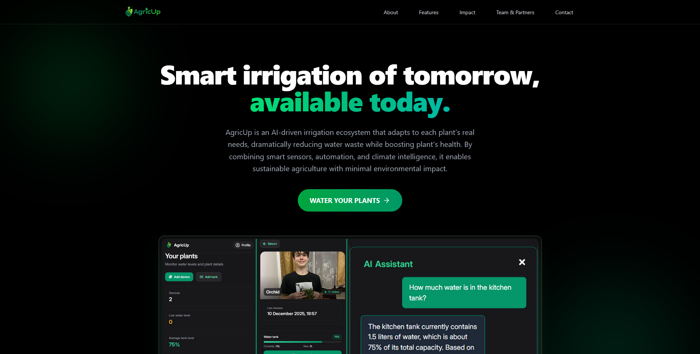
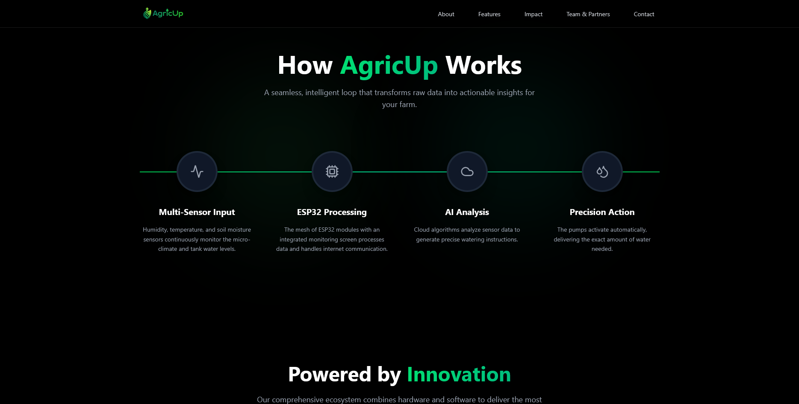
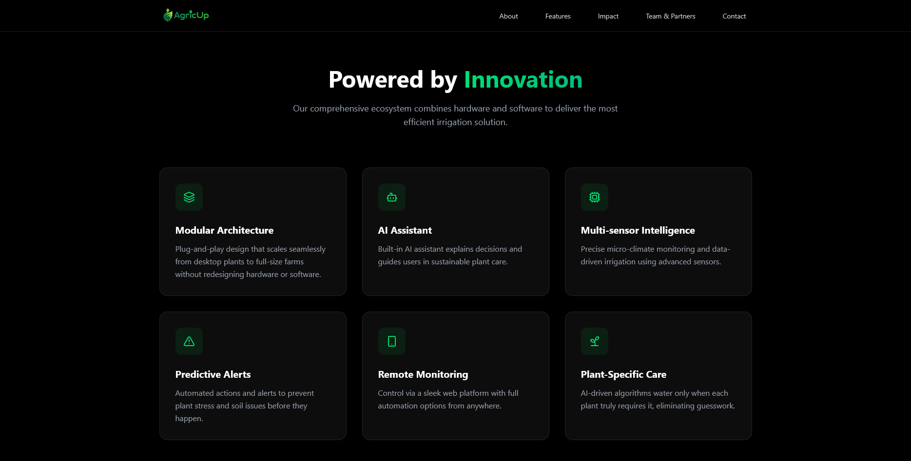
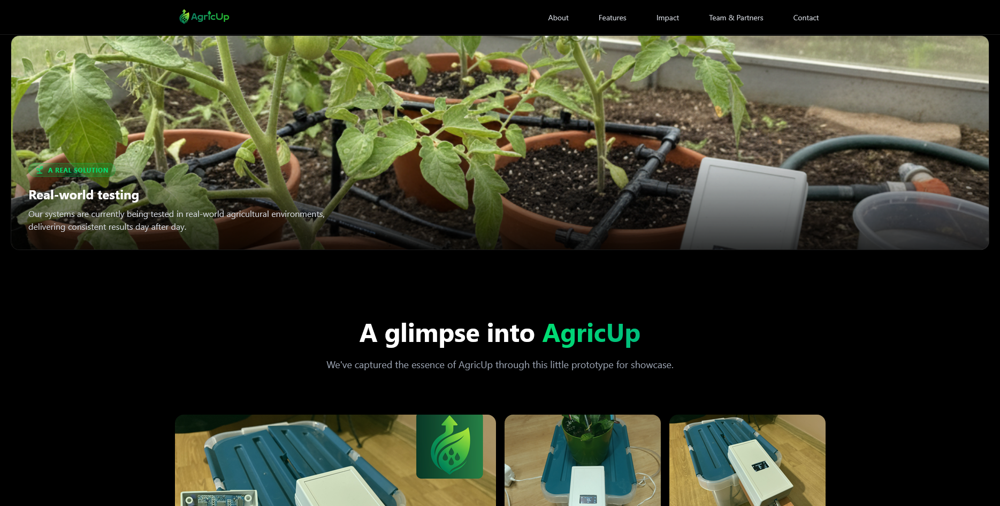
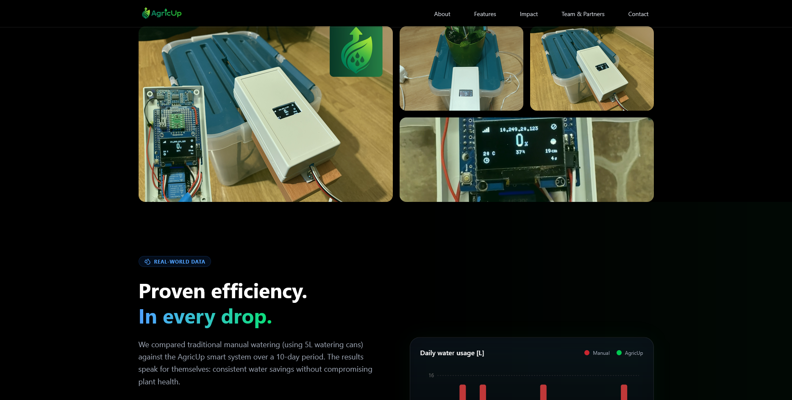
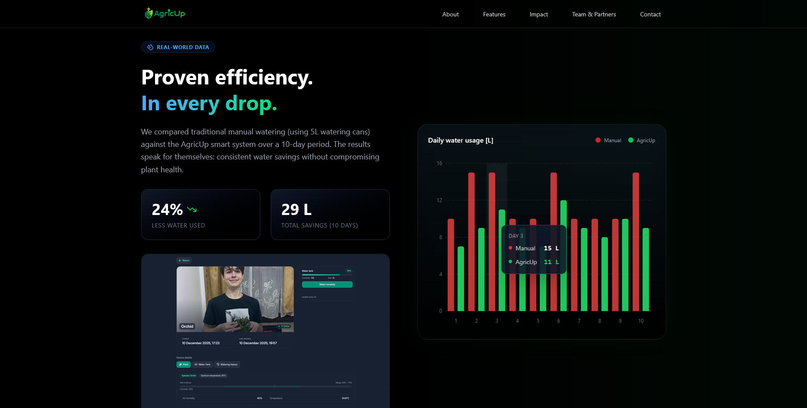
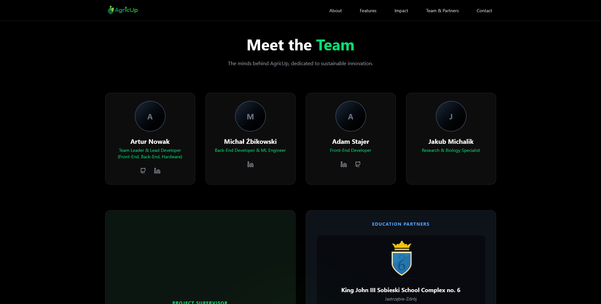
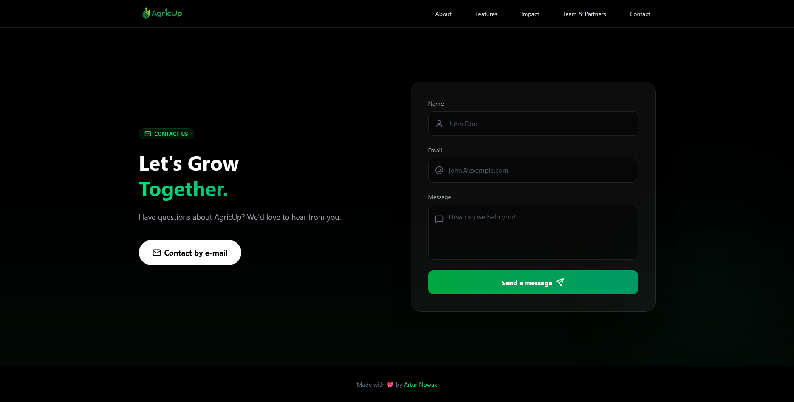

  
  <h2 align="center">Smart Irrigation of tomorrow, available today</h2>

AgricUp is an AI-driven irrigation ecosystem that adapts to each plant's real needs, dramatically reducing water waste while boosting plant's health. By combining smart sensors, automation, and climate intelligence, it enables sustainable agriculture with minimal environmental impact.

This is the website for AgricUp, built with React and Tailwind CSS.
For more information, please visit it: [https://agricup.zs6sobieski.pl/](https://agricup.zs6sobieski.pl/)

# Screenshots

